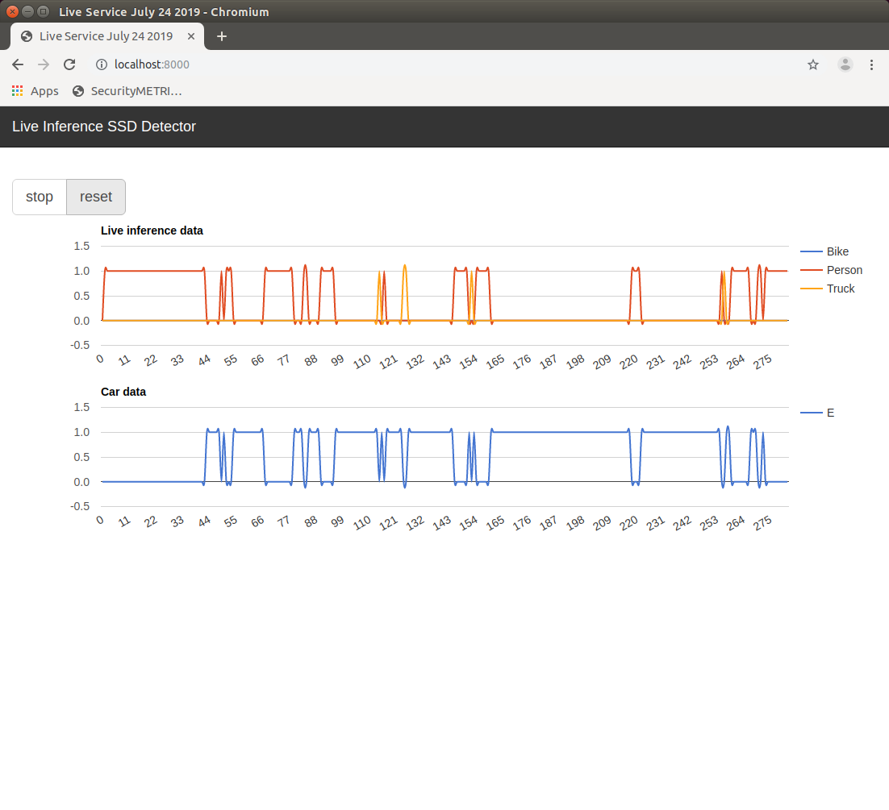

# live-tensorflowjs-charts
tensorflowjs traffic analytics flask google charts

Using Tensorflow.js to count cars, bikes, trucks, pedestrians from live webcam feed and charting data live on a Flask server using Google Charts

### Step 1

`npm install`

### Step 2

`pip install -r requirements.txt`

### Step 3

`npm run start`

### Step 4

`python flask_server.py`

### Step 5

open localhost:8000 for flask google charts

### Step 6

open localhost:3000 for tensorflow.js coco ssd model inference using live webcam feed
